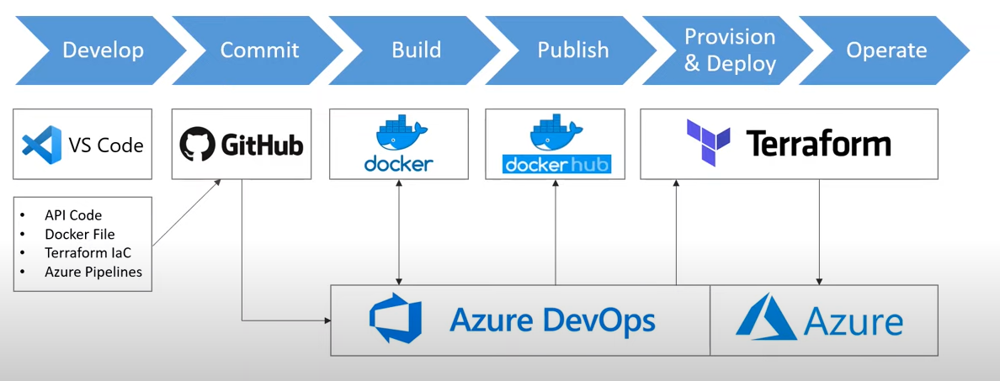

# Getting started

_TO_DO_

# Introduction
This is a PoC devloped during my home lab. In this repository you can find an api infarastructure in .Net and you can use Azure Devops to deploy it into docker container. 

# Architecture overview
This architecture is inspired by Les Jackson Binarythistle. 

